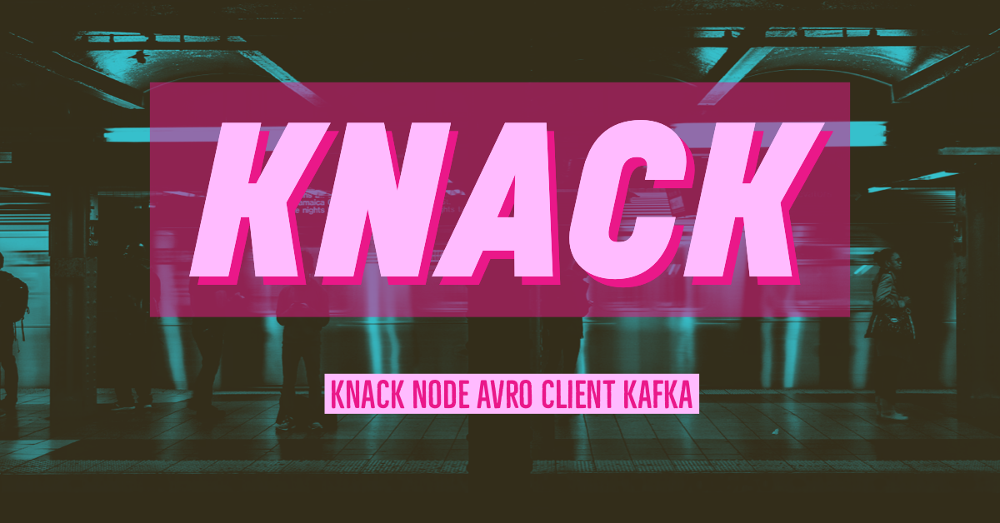

<p align="center">
  <a href="https://kafka.apache.org/">
    
  </a>
</p>

<p align="center">
  A streamlined wrapper around <a href="https://github.com/Blizzard/node-rdkafka">node-rdkafka</a> made with independent composable parts.
</p>

<p align="center">
  <a href="https://github.com/xojs/xo"></a>
  <a href="https://lerna.js.org/"></a>
</p>

## Packages

This repository is a monorepo that we manage using [Lerna](https://github.com/lerna/lerna). That means that we actually publish [several packages](/packages) to npm from the same codebase, including:

| name  |  version |
|---|---|
| [<b>`knack-avro`</b>](packages/knack-avro) | 1.0.0 |
|A module for encoding and decoding avro with Kafka.|
| [<b>`knack-consumer`</b>](packages/knack-consumer) | 1.0.0 |
|A module for consuming messages from Apache Kafka.|
| [<b>`knack-consumer-client`</b>](packages/knack-consumer-client) | 1.0.0 |
|A module for consuming records with Apache Kafka.|
| [<b>`knack-producer`</b>](packages/knack-producer) | 1.0.0 |
|A module for publishing to Apache Kafka.|
| [<b>`knack-producer-client`</b>](packages/knack-producer-client) | 1.0.0 |
|A module for producing Apache Kafka records.|
| [<b>`knack-sr`</b>](packages/knack-sr) | 1.0.0 |
|A module for interacting with the Kafka Schema Registry.|
| [<b>`knack-cli`</b>](packages/knack-cli) | 1.0.0 |
|A cli for working with Apache Kafka development.|

## Development

initialize lerna for all packages

```shell
$ lerna init
$ lerna bootstrap
```

run tests

```shell
$ npm test --silent
# or
$ npm run quick-test --silent
```

## Examples

Initial working code examples can be found in the [<b>`knack-cli/src`</b>](packages/knack-cli/src) folder.

## Contributing to the Project

The Knack team is open to contributions to our project. For more details, see our [Contribution Guide](.github/CONTRIBUTING.md).

© Optum 2019
